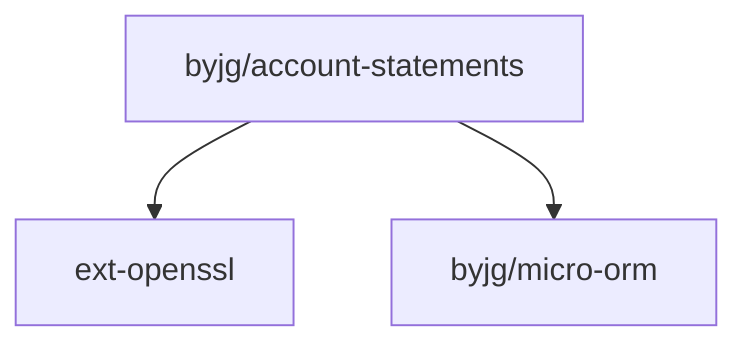

# Basic PHP Account Statements

[](https://github.com/byjg/php-account-statements/actions/workflows/phpunit.yml)
[](http://opensource.byjg.com)
[](https://github.com/byjg/php-account-statements/)
[](https://opensource.byjg.com/opensource/licensing.html)
[](https://github.com/byjg/php-account-statements/releases/)

This is a simple PHP application that allows you to create and manage account statements. It consists of a set of classes to allow control and get statements of any account.

It supports the following features:

- Multiple accounts per user;
- Multiple currencies per account
- Transaction history to avoid changes in the balance;

## How to use

### Basic usage

```php
use ByJG\AccountTransactions\Service\AccountService;
use ByJG\AccountTransactions\Service\AccountTypeService;
use ByJG\AccountTransactions\Service\StatementService;
use ByJG\AccountTransactions\Entity\AccountTypeEntity;
use ByJG\AccountTransactions\Repository\AccountRepository;
use ByJG\AccountTransactions\Repository\AccountTypeRepository;
use ByJG\AccountTransactions\Repository\StatementRepository;
use ByJG\AccountTransactions\DTO\StatementDTO;


// Initiate Repositories
$accountTypeRepo = new AccountTypeRepository($this->dbDriver);
$statementRepo = new StatementRepository($this->dbDriver);
$accountRepo = new AccountRepository($this->dbDriver);

// Initiate Services
$accountTypeService = new AccountTypeService($accountTypeRepo);
$statementService = new StatementService($statementRepo, $accountRepo);
$accountService = new AccountService($accountRepo, $accountTypeService, $statementService);

// Create a new Account Type
$accountType = new AccountTypeEntity();
$accountType->setAccountTypeId('USD');
$accountType->setName('Dollar Account');

$accountTypeService = new AccountTypeService($accountTypeRepo);
$accountTypeService->update($accountType);

// Create a new Account
$accountRepo = new AccountRepository($this->dbDriver);
$accountId = $accountService->createAccount($accountType->getAccountTypeId(), '34', 0);

// Add 200 USD to the account
$statement = new StatementDTO($accountId, 200);
$statementService->addFunds($statement);

// Withdraw 100 USD from the account
$statement = new StatementDTO($accountId, 100);
$statementService->withdrawFunds($statement);

// Add 50 USD hold to the account
$statement = new StatementDTO($accountId, 50);
$reserve = $statementService->reserveFundsForDeposit($statement);

// Accept the hold
$statementService->acceptFundsById($reserve->getTransactionId());
```

## Installation

```bash
composer require byjg/account-statements
```

## Testing

```bash
docker run --name mysql-container --rm  -e MYSQL_ROOT_PASSWORD=password -p 3306:3306 -d mysql:8.0
./vendor/bin/phpunit
```


## Dependencies  



----  
[Open source ByJG](http://opensource.byjg.com)

@todo Documentation
@todo Rest
