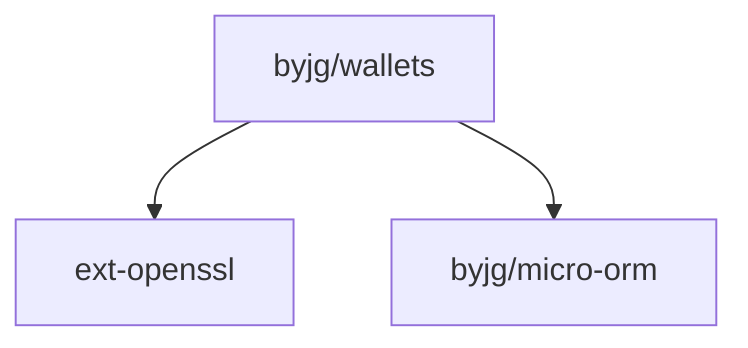

# Basic PHP Account Statements

[](https://github.com/byjg/php-account-statements/actions/workflows/phpunit.yml)
[](http://opensource.byjg.com)
[](https://github.com/byjg/php-account-statements/)
[](https://opensource.byjg.com/opensource/licensing.html)
[](https://github.com/byjg/php-account-statements/releases/)

This is a simple PHP application that allows you to create and manage account statements. It consists of a set of classes to allow control and get statements of any account.

It supports the following features:

- Multiple accounts per user;
- Multiple currencies per account
- Transaction history to avoid changes in the balance;

## How to use

### Basic usage

```php
use ByJG\Wallets\Service\WalletService;
use ByJG\Wallets\Service\WalletTypeService;
use ByJG\Wallets\Service\StatementService;
use ByJG\Wallets\Entity\WalletTypeEntity;
use ByJG\Wallets\Repository\WalletRepository;
use ByJG\Wallets\Repository\WalletTypeRepository;
use ByJG\Wallets\Repository\StatementRepository;
use ByJG\Wallets\DTO\StatementDTO;


// Initiate Repositories
$walletTypeRepo = new WalletTypeRepository($this->dbDriver);
$statementRepo = new StatementRepository($this->dbDriver);
$walletRepo = new WalletRepository($this->dbDriver);

// Initiate Services
$walletTypeService = new WalletTypeService($walletTypeRepo);
$statementService = new StatementService($statementRepo, $walletRepo);
$walletService = new WalletService($walletRepo, $walletTypeService, $statementService);

// Create a new Account Type
$walletType = new WalletTypeEntity();
$walletType->setWalletTypeId('USD');
$walletType->setName('Dollar Account');

$walletTypeService = new WalletTypeService($walletTypeRepo);
$walletTypeService->update($walletType);

// Create a new Account
$walletRepo = new WalletRepository($this->dbDriver);
$walletId = $walletService->createWallet($walletType->getWalletTypeId(), '34', 0);

// Add 200 USD to the account
$statement = new StatementDTO($walletId, 200);
$statementService->addFunds($statement);

// Withdraw 100 USD from the account
$statement = new StatementDTO($walletId, 100);
$statementService->withdrawFunds($statement);

// Add 50 USD hold to the account
$statement = new StatementDTO($walletId, 50);
$reserve = $statementService->reserveFundsForDeposit($statement);

// Accept the hold
$statementService->acceptFundsById($reserve->getTransactionId());
```

## Installation

```bash
composer require byjg/account-statements
```

## Testing

```bash
docker run --name mysql-container --rm  -e MYSQL_ROOT_PASSWORD=password -p 3306:3306 -d mysql:8.0
./vendor/bin/phpunit
```


## Dependencies  



----  
[Open source ByJG](http://opensource.byjg.com)

@todo Documentation
@todo Rest
